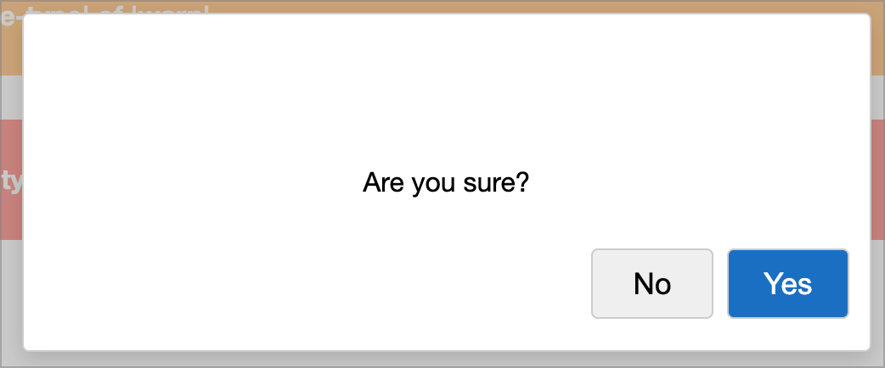

# Frame Front-end Library

The **Frame Front-end Library** is the App Nerds JavaScript component and CSS library. 
It contains reusable JavaScript components and styles for building website and applications. 
All code is pure ES6 JavaScript and CSS3. It is designed to work well with applications 
using the Go Frame framework.

## 🚀 Getting Started

If you want to use the "kitchen sink" approach, simply start by including the base CSS
and **frame.min.js** in your HTML like below (updating your pathing to match yours set up).

```html
<!DOCTYPE html>
<html lang="en">

<head>
  <meta charset="UTF-8" />
  <meta name="viewport" content="width=device-width, initial-scale=1.0" />
  <title>Base Example</title>
  <link rel="stylesheet" href="/static/base.min.css" />
  <link rel="stylesheet" href="/static/icons.min.css" />
  <link rel="stylesheet" href="/static/components.min.css" />
</head>

<body>
  <main>
    <h1>Base Example</h1>
  </main>

  <script type="module">
    import { Alerter } from "/static/frame.min.js";
  
    document.addEventListener("DOMContentLoaded", () => {
    const alerter = new Alerter();
 
    alerter.info("Hello!");
  });
  
  </script>
</body>
</html>
```

## CSS

Frame includes a pretty basic CSS starting template in **base.css** which covers
a reset and styles for most of your basic elements, such as headings, tables, 
and buttons. It makes use of CSS variables to drive the the colors and look
of these elements. Most base elements do not require any additional classes
to achieve their look.

### Headings
Headings start with a font size of *2.2rem* for H1 and move down from there to 
*1.4rem* for H3. H1 have a color of `--primary-color`.

### Buttons
By default all buttons have a slightly larger font size (*1.1rem*) and a slightly
rounded border of `--border-color`. They also have a click ripple effect. I've also
defined three custom classes for common button uses.

* `.action-button` - Used to denote a primary action. Background is `--action-color`, 
  foreground is `--white`.
* `.success-button` - Used to denote a general success. Background is `--success-color`,
  foreground is `--white`.
* `.danger-button` - Used to denote a dangerious operation. Background is `--danger-color`,
  foreground is `--white`.

### Tables
Tables are styled out of the box. A table should be constructed like so.

```html
<table>
  <caption>Table Example</caption>
  <thead>
    <tr>
      <th scope="col">Col 1</th>
      <th scope="col">Col 2</th>
      <th scope="col">Col 3</th>
    </tr>
  </thead>
  <tbody>
    <tr>
      <th scope="row">Value 1</th>
      <td>Value 2</td>
      <td>Value 3</td>
    </tr>
    <tr>
      <th scope="row">Another set</th>
      <td>Value 2</td>
      <td>Value 3</td>
    </tr>
  </tbody>
</table>
```

Table styles are driven by the following variables.

* `--table-border-color` - The border of the table and the nth row color
* `--table-header-background-color` - The background color of the header row
* `--table-header-color` - The foreground color of the header row

### Forms
Forms are designed to work with very little markup out of the box. Here is an 
example form.

```html
<form>
  <label for="first">First</label>
  <input type="text" id="first" autocomplete="name" />
  <small>
    This is additional information for this form field
  </small>

  <label for="second">Second</label>
  <select id="second" autocomplete="on">
    <option value="value1">Value 1</option>
    <option value="value2">Value 2</option>
    <option value="value3">Value 3</option>
  </select>

  <label for="third">Third</label>
  <textarea id="third" autocomplete="off">Text goes here</textarea>

  <footer>
    <button type="button"><i class="icon--mdi icon--mdi--arrow-left" alt="Left arrow"></i> Cancel</button>
    <button class="action-button">Action!</button>
  </footer>
</form>
```

Form elements are designed to be legible with a little larger font and
extra padding. Form elements have a focus border and box shadow to clearly
indicate where the current focus is. Finally, the actions to take on a form
should be placed in a footer element.

### Cards
Frame provides a basic concept of a **Card** element. It is designed to have
a title, body content, and a footer. Here is an example.

```html
<div class="cards">
  <article>
    <h3>Card Demonstration</h3>
    <p>
      This is the first card. It contains content.
      The markup is simple.
    </p>

    <footer>
      <button>Secondary</button>
      <button class="action-button">Primary</button>
    </footer>
  </article>
</div>
```

The first thing to do is wrap all of your cards in a div with a class of `.cards`.
Then, for each card, use an `<article>` tag. Each card should have a title using
a heading. This will likely be a **H3** or lower (never an H1 for sure). The body
can be whatever content you want. Finally, add a footer with buttons to take
actions if you wish.

## Icons
Icons make use of a library provided by <a href="https://icon-sets.iconify.design/mdi/">Iconify</a>.
A few icons are already included in **icons.css** from the Material Design set. To include new ones, 
search for the icons you want and add them to the <em>icons.css</em> file by URL like 
`https://api.iconify.design/mdi.css?icons=home,arrow-left,arrow-right,cog`.

## Components
Components are either custom web components or Javascript libraries to enhance
your application.

### Color Picker
The Color Picker component can be used to allow a user to pick a color. 


### Message Bar
A message bar is a web component which displays a message that can have a *type*, such
as **info**, **success**, **warn**, and **error**.


```html
<message-bar message-type="info" message="This is an informational message. Use 'message-type' of 'info'.">
</message-bar>

<message-bar message-type="success" message="This is a success message. Use 'message-type' of 'success'.">
</message-bar>

<message-bar message-type="warn" message="This is a warning message. Use 'message-type' of 'warn'.">
</message-bar>

<message-bar message-type="error" message="This is an error message. Use 'message-type' of 'error'.">
</message-bar>
```

### Alerts and Dialogs

Alerts are small "toast-like" messages.





```html
<div style="margin-bottom: 1rem;">
  <button id="showInfoAlert">Show Info Alert</button>
  <button id="showSuccessAlert">Show Success Alert</button>
  <button id="showWarnAlert">Show Warn Alert</button>
  <button id="showErrorAlert">Show Error Alert</button>
  <button id="showConfirm">Show Confirm</button>
  <button id="showPrompt">Show Prompt</button>
</div>

<prompter-ui width="20em" action-button="#promptSaveAction" cancel-button="#promptCancelAction" id="prompt">
  <h4 slot="title" style="margin:0;">Say Hi</h4>
  <div slot="body">
    <form>
      <label for="greetingChoice">Greeting</label>
      <select id="greetingChoice" style="width: 100%;">
        <option value="Hello">Hello</option>
        <option value="Howdy">Howdy</option>
        <option value="Hi">Hi</option>
      </select>
      
      <label for="yourName">Your Name</label>
      <input type="text" id="yourName" style="width: 100%;" />
    </form>
  </div>
  
  <nav slot="buttons" part="buttons">
    <button type="button" id="promptCancelAction">Cancel</button>
    <button type="button" class="action-button" id="promptSaveAction">Go</button>
  </nav>
</prompter-ui>

<script type="module">
import {Alerter, Confirmer, Prompter} from "/static/frame.js";

document.addEventListener("DOMContentLoaded", () => {
  const alerter = new Alerter();
  const confirmer = new Confirmer();

  document.getElementById("showInfoAlert").addEventListener("click", () => {
    alerter.info("This is an information alert!");
  });

  document.getElementById("showSuccessAlert").addEventListener("click", () => {
    alerter.success("This is a success alert!");
  });

  document.getElementById("showWarnAlert").addEventListener("click", () => {
    alerter.warn("This is a warning alert!");
  });

  document.getElementById("showErrorAlert").addEventListener("click", () => {
    alerter.error("This is an error alert!");
  });

  /*
   * Click to show confirm
   */
  document.getElementById("showConfirm").addEventListener("click", async () => {
    const result = await confirmer.yesNo("Are you sure?");
    alerter.info(`You chose "${result}"`);
  });

  /*
   * Click to show prompt
   */
  document.querySelector("#showPrompt").addEventListener("click", () => {
    document.querySelector("#prompt").show();
  });

  const prompterEl = document.querySelector("#prompt");

  prompterEl.addValidatorFunc((values) => {
    if (values.yourName === "") {
      return {
        validationErrors: ["Your name is required"],
        isValid: false,
      };
    }

    return {validationErrors: [], isValid: true};
  });

  prompterEl.addEventListener("validation-failed", (e) => {
    alerter.error(e.detail.validationErrors.join("<br />"));
  });

  prompterEl.addEventListener("confirm", e => {
    alerter.info(`${e.detail.greetingChoice} ${e.detail.yourName}!`);
  });
</script>
```
### Popup Menu
The popup menu is a web component that is shown with a trigger element.


```html
<button id="showPopup" aria-haspopup="menu">Show popup menu</button>

<popup-menu id="popup" trigger="#showPopup">
  <popup-menu-item id="menuItem1" text="Menu Item 1" data="Value 1"
    icon="icon--mdi icon--mdi--home"></popup-menu-item>
  <popup-menu-item id="menuItem2" text="Menu Item 2" data="Value 2"
    icon="icon--mdi icon--mdi--plus"></popup-menu-item>
  <popup-menu-item id="menuItem3" text="Menu Item 3" data="Value 3"
    icon="icon--mdi icon--mdi--cog"></popup-menu-item>
</popup-menu>

<script type="module">
/*
 * Popup menu events
 */
document.getElementById("showPopup").addEventListener("click", () => {
  showPopup("#popup");
});

document.getElementById("popup").addEventListener("menu-item-click", (e) => {
  alert(`You clicked ${e.detail.text} with data ${e.detail.data}`);
});
</script>
```

### Spinner
A spinner, which can be used to indicate progress and stop users from
clicking on elements. It can also be used with the `fetcher` component.


```html
<button id="showSpinner">Show Spinner</button>

<script type="module">
import { Spinner } from "/static/frame.js";

document.addEventListener("DOMContentLoaded", () => {
  const spinner = new Spinner();

  /*
   * Click to show spinner
   */
  document.getElementById("showSpinner").addEventListener("click", () => {
    spinnerer.show();
  
    setTimeout(() => {
      spinnerer.hide();
    }, 3000);
  });
});
</script>
```

### Tabs
Tabs are a pure CSS way to have content seperated into tabbed sections.


```html
<h3>Tabs</h3>

<div class="tabset">
  <input type="radio" name="tabset1" id="tabset-description" hidden aria-hidden="true" checked>
  <input type="radio" name="tabset1" id="tabset-about" hidden aria-hidden="true">

  <ul hidden aria-hidden="true">
    <li>
      <label for="tabset-description">Description</label>
    </li>
    <li>
      <label for="tabset-about">About</label>
    </li>
  </ul>

  <div>
    <section>
      <h4>Description</h4>
      <p>
        This is a tabbed interface that doesn't use any JavaScript. All CSS baby!
      </p>
    </section>
    
    <section>
      <h4>About</h4>
      <p>
        This is pulled from <a href="https://cutcodedown.com/for_others/medium_articles/tabsWithoutJS/">Jason
        Knight</a>, who is brilliant at CSS and accessibility.
      </p>
    </section>
  </div>
</div>
```

### Tag Cloud
A tag cloud. It's for displaying tags... in a cloud.


```html
<h3>Tag Cloud</h3>
<tag-cloud id="tagCloud"></tag-cloud>

<script type="module">
import {TagCloud} from "/static/frame.js";

const tagCloud = document.getElementById("tagCloud");

tagCloud.addTags([
  {id: 1, label: "JavaScript", data: {id: 1, name: "JavaScript"}},
  {id: 2, label: "TypeScript", data: {id: 2, name: "TypeScript"}},
  {id: 3, label: "Python", data: {id: 3, name: "Python"}},
  {id: 4, label: "Java", data: {id: 4, name: "Java"}},
  {id: 5, label: "C#", data: {id: 5, name: "C#"}},
  {id: 6, label: "C++", data: {id: 6, name: "C++"}},
  {id: 7, label: "Go", data: {id: 7, name: "Go"}},
  {id: 8, label: "Rust", data: {id: 8, name: "Rust"}},
  {id: 9, label: "Ruby", data: {id: 9, name: "Ruby"}},
  {id: 10, label: "PHP", data: {id: 10, name: "PHP"}},
  {id: 11, label: "Swift", data: {id: 11, name: "Swift"}},
  {id: 12, label: "Kotlin", data: {id: 12, name: "Kotlin"}},
  {id: 13, label: "Dart", data: {id: 13, name: "Dart"}},
  {id: 14, label: "R", data: {id: 14, name: "R"}},
  {id: 15, label: "Perl", data: {id: 15, name: "Perl"}},
  {id: 16, label: "Scala", data: {id: 16, name: "Scala"}},
  {id: 17, label: "Haskell", data: {id: 17, name: "Haskell"}},
  {id: 18, label: "Lua", data: {id: 18, name: "Lua"}},
]);

tagCloud.addEventListener("tag-click", (e) => {
  console.log(e.detail.data);
  alerter.info(`You clicked ${e.detail.label}`);
});

tagCloud.addEventListener("tag-remove", (e) => {
  console.log(e.detail.data);
  alerter.info(`You deleted ${e.detail.label}`);
});
</script>
```

### Ajax Table
The Ajax Table web component that adds the ability to decorate a regular
`<table>` element by fetching JSON data from a server-side endpoint to populate
table rows. It also provides the ability to page through results.


[View documentation](./src/ajax-table/README.md)
